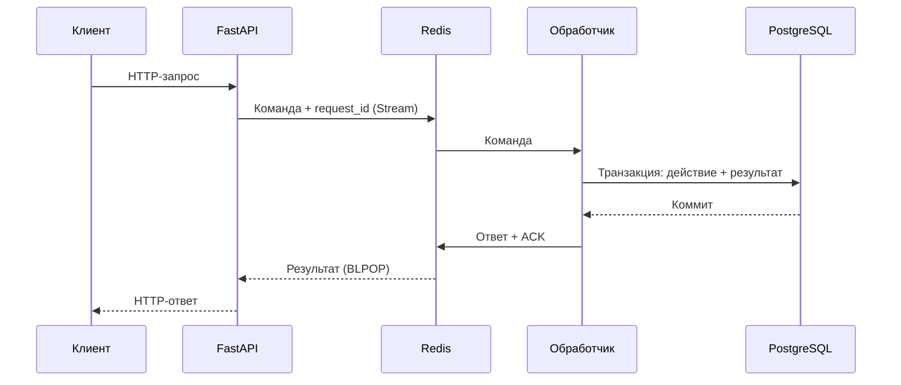

# Квитто — API платежей

Тестовое задание Junior Python / FastAPI. Python 3.12, FastAPI, Pydantic v2,
SQLAlchemy, PostgreSQL 17 и Redis 7.4. Зависимости зафиксированы в `uv.lock`.

## Устройство проекта

Приложение запускается в четырёх контейнерах:

| Контейнер | Что делает |
| --- | --- |
| `api` | Принимает HTTP-запрос, проверяет входные данные, отправляет команду через Redis и возвращает ответ клиенту. Swagger — показная часть API. |
| `worker` | Получает команду, выполняет алгоритм платежа, работает с PostgreSQL, отправляет результат через Redis. |
| `redis` | Хранит очередь команд Redis Streams и временные ответы. |
| `postgres` | Хранит тарифы, платежи и результаты обработанных команд. |



Каждый из четырёх бизнес-эндпоинтов проходит через Redis. Результат ждём в том же
HTTP-запросе: поэтому запрещённый переход статуса сразу возвращает требуемый `409`.
Ответ клиенту возвращает `api`. Для этой схемы достаточно одной PostgreSQL.

## Запуск

Нужны Docker Engine и Docker Compose v2 с поддержкой `--wait`.

```bash
cp .env.example .env
docker compose up --build --detach --wait --wait-timeout 120
```

- Swagger: <http://localhost:8000/docs>
- Проверка готовности: <http://localhost:8000/health>
- Тарифы: <http://localhost:8000/tariffs>

Команда без `.env` тоже работает с настройками по умолчанию. `API_PORT` меняет порт
API. PostgreSQL и Redis доступны внутри сети Compose. Данные сохраняются в именованных
томах; обычный `docker compose down` их сохраняет.

Если порт `8000` занят, задайте в `.env` `API_PORT=18000`; Swagger и примеры запросов
тогда доступны на `http://localhost:18000`.

Compose использует отдельные подсети `10.203.0.0/24` (приложение) и
`10.203.1.0/24` (тесты). Их можно изменить через `APP_NETWORK_SUBNET` и
`TEST_NETWORK_SUBNET`, если эти адреса уже заняты в вашей сети.

```bash
docker compose logs --follow api worker
docker compose down
```

## Примеры запросов

Получение тарифов:

```bash
curl http://localhost:8000/tariffs
```

Платёж по standard, промокод и рассрочка на три месяца:

```bash
curl -i http://localhost:8000/payments \
  -H 'Content-Type: application/json' \
  -H 'Idempotency-Key: course-order-001' \
  -d '{"tariff_id":"standard","email":"student@example.com","method":"installment","installment_months":3,"promo_code":"kvitto10"}'
```

Первый запрос вернёт `201`, повтор с этим ключом — `200` и тот же платёж.
Сумма к оплате — `1791000`, скидка — `199000`, график — `[597000,597000,597000]`.
`discount` означает размер скидки в копейках, `amount` — итоговую сумму после скидки.

Подставьте `id` из ответа вместо `PAYMENT_ID`:

```bash
curl http://localhost:8000/payments/PAYMENT_ID

curl -i http://localhost:8000/webhooks/bank \
  -H 'Content-Type: application/json' \
  -d '{"payment_id":"PAYMENT_ID","status":"succeeded"}'
```

Успешный вебхук вернёт `200 {"result":"ok"}`. Повтор этого HTTP-вебхука уже пытается
выполнить `succeeded → succeeded` и вернёт `409 {"error":"invalid_transition"}`.

## Правила и ошибки

- Тарифы создаются при старте worker: `basic = 990000`, `standard = 1990000`,
  `premium = 2990000`. Все суммы в API и БД — целые копейки.
- `KVITTO10` даёт скидку 10%, регистр не важен. Неизвестный код — стандартный `422`.
- Способы оплаты: `card`, `sbp`, `installment`. Для рассрочки нужен целочисленный
  `installment_months`: `3`, `6`, `12`. Для остальных способов поле должно быть `null`
  или отсутствовать; `schedule` в ответе равен `null`.
- Остаток от деления суммы распределяется по одной копейке в первые платежи.
  Например, `1990000 / 3` даёт `[663334,663333,663333]`.
- Разрешены только `pending → succeeded`, `pending → failed`, `succeeded → refunded`.
  Запрещённый переход не меняет статус, ответ — `409 {"error":"invalid_transition"}`.
- Несуществующий платёж или тариф — `404`. Некорректные входные данные — стандартный
  ответ FastAPI `422`.
- `Idempotency-Key` — непустая строка до 200 символов. Ключ глобален для создания
  платежа. Новый валидный запрос с уже использованным ключом возвращает этот платёж,
  даже если поля нового запроса отличаются. Запросы без ключа создают новые платежи.
- Ошибка соединения с Redis — `503`, отсутствие ответа worker за отведённое время —
  `504`. Таймаут не отменяет уже отправленную команду: для повторной попытки создания
  платежа используйте тот же `Idempotency-Key`.

## Надёжность очереди

Worker использует consumer group Redis Streams. Команда подтверждается после коммита
БД и записи ответа в Redis. Незавершённые команды другой consumer можно забрать через
`XAUTOCLAIM`; период ожидания по умолчанию — 5 секунд.

`request_id` — внутренний UUID одной команды. Её результат хранится в таблице
`processed_commands` в той же транзакции, что и изменение платежа. Если worker упадёт
после коммита, повторная доставка вернёт сохранённый результат. Это работает и для
платежей без пользовательского ключа, и для вебхуков.

`Idempotency-Key` объединяет отдельные HTTP-запросы на создание платежа. Уникальное
ограничение в PostgreSQL защищает от дублей при нескольких worker. Блокировка
`SELECT ... FOR UPDATE` защищает смену статуса от одновременных вебхуков.

Ответы Redis удаляются после чтения или по TTL 60 секунд. Обработанные сообщения
удаляются из Stream, незавершённые сохраняются. Результаты в PostgreSQL сохраняются
без автоматической очистки. Redis использует AOF с `appendfsync always` и отдельный том.

Первый запуск создаёт схему через SQLAlchemy `create_all`. Миграции Alembic в это
решение не включены, как допускает задание.

Справка: [Redis Streams](https://redis.io/docs/latest/develop/data-types/streams/),
[XAUTOCLAIM](https://redis.io/docs/latest/commands/xautoclaim/),
[PostgreSQL ON CONFLICT в SQLAlchemy](https://docs.sqlalchemy.org/en/20/dialects/postgresql.html#insert-on-conflict-upsert).

## Подпись банка — дополнительная возможность

Пустой `WEBHOOK_SECRET` отключает проверку. Чтобы включить её, задайте секрет в `.env`
и пересоздайте API командой `docker compose up --detach --wait`.

Банк должен передать `X-Signature`: hex-строку HMAC-SHA256 от **исходных байтов тела**
с этим секретом. Отсутствующая или неверная подпись — `401`, платёж не меняется.
В тестах есть пример вычисления подписи: `tests/test_webhooks.py`.

## Тесты и CI

Все тесты в контейнере, включая интеграционные с настоящими PostgreSQL и Redis:

```bash
docker compose -f compose.test.yaml run --build --rm tests
docker compose -f compose.test.yaml down
```

У тестовой конфигурации отдельная сеть и БД `kvitto_test`. Рабочие тома не используются.
Интеграционные тесты запускают API и два worker в процессе pytest, а PostgreSQL и Redis
работают в отдельных контейнерах. В CI также проверяется запуск всех четырёх контейнеров
приложения и HTTP-запрос к развёрнутому API.

Для разработки нужен Python 3.11+ и [uv](https://docs.astral.sh/uv/):

```bash
uv sync --frozen
docker compose -f compose.test.yaml up --detach --wait postgres redis
uv run --frozen pytest -q
uv run --frozen ruff check .
uv run --frozen ruff format --check .
docker compose -f compose.test.yaml down
```

Тесты по умолчанию подключаются к PostgreSQL на `localhost:55432`, Redis на
`localhost:56379`. Можно задать `TEST_DATABASE_URL` и `TEST_REDIS_URL`. Имя тестовой БД
обязано заканчиваться на `_test`: тесты очищают её схему перед запуском.

GitHub Actions (`.github/workflows/ci.yml`) запускается при каждом `push` и
`pull_request`: Ruff, проверка форматирования, весь pytest, сборка и запуск приложения.

## Как разобраться в коде

Рекомендуемый порядок чтения:

1. `app/schemas.py` — поля запросов, ответов и правила валидации.
2. `app/domain.py` — скидка, рассрочка и допустимые переходы. Эти функции не зависят от БД.
3. `app/models.py` — три таблицы и ограничения PostgreSQL.
4. `app/service.py` — создание платежа, смена статуса, транзакция и защита от повторов.
5. `app/broker.py` — отправка команды и получение ответа через Redis.
6. `app/worker.py` — чтение очереди, обработка и восстановление команд.
7. `app/main.py` — HTTP-эндпоинты и перевод результата worker в ответ клиенту.
8. `tests/` — примеры нормальных запросов, ошибок и одновременной обработки.

`app/config.py` содержит настройки, `app/database.py` — подключение и начальные тарифы.
История запросов к ассистенту и замеченные слабые решения записаны в `AI_LOG.md`.
